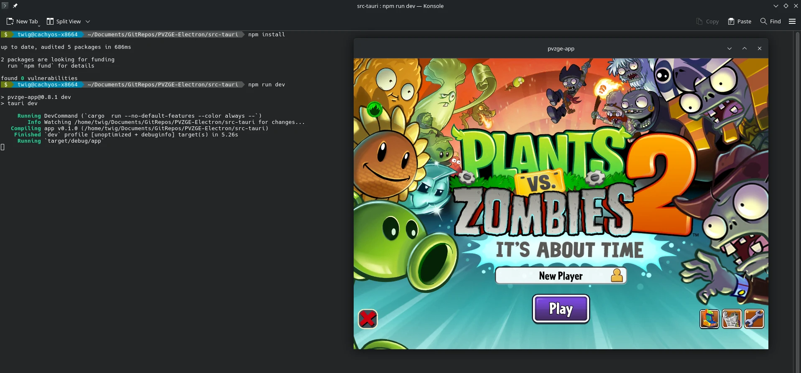
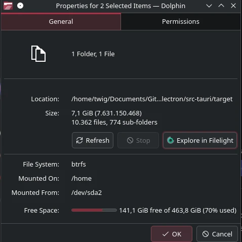

# Experimental tauri packaging

This works
```sh
cd src-tauri
npm install
npm run dev
```



Then you're supposed to run this to get an actual build with;
```
npm run build
```

but game assets too big or something and gets stuck at the very end I kinda need help fixing that

Also it kinda goes on forever when you do that and goes on forever like a zipbomb



# Run this if you're getting symbol related errors and use a regular terminal if you can (Not IDE one)
```sh
cargo clean
sudo ldconfig
```
